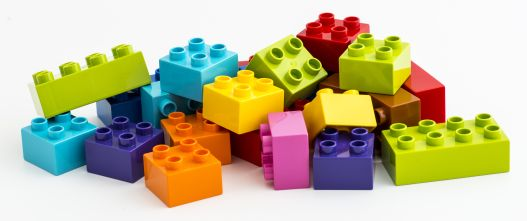
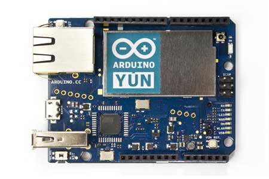
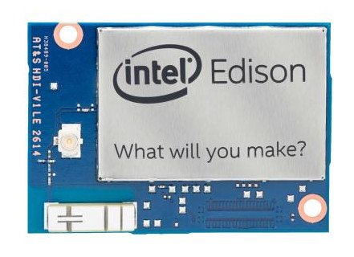

The **IoT Cookbook** provides a collection of ready-to-build recipes for IoT components.

Building on components, developers get a head start and can focus on creating the actual application functionality. But of course you learn how to build your own, reusable components as well.

The IoT Cookbook is all open-source: the <b><a href="https://github.com/crossbario/crossbarexamples/tree/master/iotcookbook">code is on GitHub</a></b> and Apache 2.0 or MIT licensed, and the recipes and texts are free to use under the Creative Commons license.

<b>News, 2015/08/08:</b> We've streamlined the Getting Started pages for all devices, in particular the Yun is now much simpler to setup. And we've released first pages for the Intel Edison

 

<b>Quick access by device type:</b>

All recipes and documentation in the IoT Cookbook can be accessed starting from one of the covered devices. The devices we currently support are:
  

   

      <a href="Raspberry-Pi">
         Raspberry Pi 
         
      </a>
   

   

      <a href="Arduino-Yun">
         Arduino Yun 
         
      </a>
   

   

      <a href="Tessel">
         Tessel 
         
      </a>
   

   

      <a href="Edison">
         Edison 
         
      </a>
   

&nbsp;

 
 
 

<b>Note:</b>
If you find errors, bugs or other issues in above, or if you have new contributions (awesome!!), we would be happy to receive your <a href="https://github.com/crossbario/crossbarwww">feedback or PRs on GitHub</a>!

# Overview

   

      <b>You want to solve a problem and focus your efforts at the application level</b>, not fiddle around to get some basic IoT sensor or actuator component built and connected to your application backends.
   

   

      With the component collection and all the recipes and tutorials, the IoT Cookbook wants to <b>free you from having to reinvent the wheels all over again</b>:
   

    
   <ul>
      <li>
         All components come with <strong>built-in connectivity</strong>. They can connect from anywhere, and you can easily build distributed applications.
      </li>
      <li>
         All components can <strong>communicate freely with each other</strong> - including calling procedures. The compoments connect via a Crossbar.io application router. Client libraries for WAMP, the protocol used, are available for 9 languages (and growing). You can also integrate services with REST APIs, so your applications can talk to pretty much anything on the internet.
      </li>
      <li>
         All recipes include <strong>step-by-step instructions</strong> to get things working. Just follow the instructions - no need to worry about the technological background details. If you want to dive deeper into the technology, we provide links to get your started.
      </li>
      <li>
         The software used in these recipes is <strong>open source</strong>, and part of a growing ecosystem aorund the WAMP protocol.
      </li>
      <li>
         A <strong>variety of microcontrollers</strong>, including the Raspberry Pi and Arduino Yun, are used as part of components.
      </li>
   </ul>

# Running things

The code for all of the above is in the [crossbarexamples repository](https://github.com/crossbario/crossbarexamples) under `iotcookbook`. Clone this locally or download it as a ZIP file.

# Getting a WAMP router

There are three main ways to gettin a WAMP router

* We offer a [demo instance](../docs/Demo-Instance) (**under construction**) for testing and light development workloads.
* You can quickly spin up a virtual machine with Crossbar.io preinstalled. We suggest [Microsoft Azure](../docs/Setup-on-Microsoft-Azure), but [Amazon EC2](../docs/Setup-on-Amazon-EC2) also works.
* You can [install Crossbar.io yourself](../docs/Local-Installation).

# Devices

Pick a microcontroller and see what we are offering for it:

* [[Raspberry Pi]]
* [[Arduino Yun]]
* [[Tessel]]
* Upcoming: [Intel Edison](Intel-Edison-Setup)

<!--

      
      
      

-->

# Components

Building blocks, ready to use for solving your problem!

* Sensors
   * Accelerometer - [Tessel](Tessel Accelerometer)/[Yun](Arduino Yun Accelerometer)
   * Ambient Light - [Yun](Arduino Yun Ambient Light Sensor)
   * Camera - [Tessel](Tessel Camera)/[Raspberry Pi](Raspberry Pi Camera)
   * Tilt Sensor - [Yun](Arduino Yun Tilt Sensor)
   * [Raspberry Pi Temperature Monitor](Raspberry Pi Temperature Monitor)
   * Weighing Pad - [Yun](Arduino Yun Weighing Pad)
* Inputs
   * X-Box Controller -[Raspberry Pi](Raspberry Pi Xbox Controller)
   * Buttons - [Yun](Arduino Yun Buttons)
   * Potentiometer - [Yun](Arduino Yun Potentiometer)
   * Novation Launchpad - [Raspberry Pi](Raspberry Pi Novation Launchpad) (**under construction**)
* Outputs
   * Speech Synthesis - [Raspberry Pi](Raspberry Pi Speech Synthesis)
   * Sample Playback -[Raspberry Pi](Raspberry Pi Sample Player)
   * Lights - [Yun](Arduino Yun Lights)
   * [LED Matrix Display](Arduino Yun LED Matrix Display)
   + [Browser Remote Control](Browser Remote Control)
   + [Reveal.js Remote Control](Reveal.js Remote Control)
   + [WAMP widgets](WAMP Browser Widgets) (**under construction**)

plus generic remote access & control of GPIO pins on the

* [Arduino Yun](Arduino Yun Remote GPIO)
* [Raspberry Pi](Raspberry Pi Remote GPIO) (**under construction**)

# Applications

Applications which use the components. Get an idea for how combining things works, find code to re-use, be inspired - and maybe already find a solution which fits your needs!

* [Alarm Application](Apps Alarm)
* [Digital Signage](Digital Signage)
* [Euro Pallet Load](Euro Pallet Load)
* [Real-time charting with the Arduino Yun](Arduino Yun Real-time Charting) (**under construction**)
